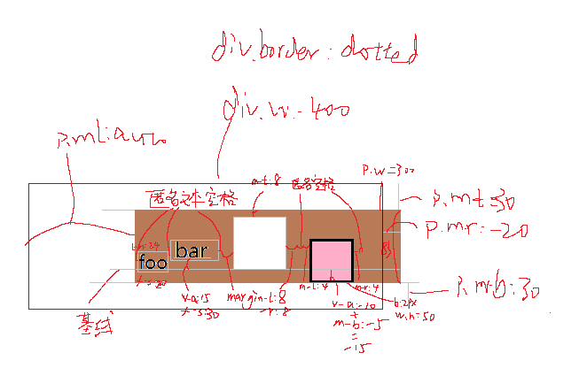

# 开卷测试，可以查书本、网络及上课视频

01. 列出至少 7 个常用 Linux 命令及其基本使用方法
  * pwd -打印当前工作目录
  * cd -改变当前工作目录
  * curl 下载路径 -o 输出路径
  * ls -lha 查询当前目录下所有文件及文件夹状态
  * vim 进入vim编辑器
  * echo 内容 > a.txt 把echo命令的输出写到a.txt里，没有就创建a.txt
  * mkdir  文件夹名 -创建文件夹
  * rmdir -删除空文件夹
  * rm 文件名 -删除文件
  * mv old new -移动绝对路径old到new路径（old=new重命名）
  - git status -查看当前仓库状态
  - git diff -查看追踪文件与上个版本有什么不同
  - git add newFile -把newFile添加到暂存区
  - git commit -a -m "message" -把暂存区里的所有文件更新到当前版本
  - git remote add [subject] [url] -通过subject名称链接到远程仓库的url
  - git push -u [subject][branch] -推送版本更新到subject项目里的branch分支
  - git remote -v -查看远程仓库
  - git remote set -url[subject] [url] -重置subject的仓库地址

02. 什么是 html 实体？常见 html 实体有哪些？

  一些字符对于HTML来说是预留的、拥有特殊的含义，比如标签的尖括号，或者空格、换行符等。可以通过如`&#169;`这样的语法。
  
  常见的html实体（字符、符号实体）有<>&lt;&gt;,空格实体&nbsp;十六进制&#1693;等等。

03. 计算机为什么使用二进制？

  二进制足够简单且足够使用。计算机通电把电信号转换成数字信号，电信号就可以用0和1代表有无电信号、或者高低电平，表达一定的信息。

04. 什么是 Unicode？如何表示，有什么作用？最通用的 Unicode 实现是？

  Unicode万国码编码方案，把每种语言的所有字符都统一设定了唯一的二进制编码，可以跨语言跨平台的实现文本转换和处理。最通用的Unicode实现是UTF-8和utf-16，采用变长编码的方式通过1个字节或2个字节来表示单个字符标识。

05. 什么是 GUI，什么是 CLI，什么是接口/界面？现实生活中有哪些例子？

  GUI：graphic user interface，用户图形界面；CLI：command line interface，命令行界面。界面就是人与计算机交互的媒介。界面的例子诸如电脑显示屏、手机显示屏等等；用户图形界面有windows系统的GUI、网页、软件程序可视化界面等；命令行界面有PowerShell、GitBash、Linux的命令行等。

06. 在什么情况下 html 标签可以不需要闭合？

  非XML里一些自闭合标签可以不用闭合，一般体现在替换元素的标签上。（显示的内容是元素属性）。  

16. 在一些情况下某些非自闭合标签的结束标签可以省略的原因是什么？

  以前的标签没有形成使用标准、或是很多人没有形成使用标准的观念，进而省略了一些结束标签。但浏览器会在检测到新的开始标签时自动补全缺少的结束标签，利用浏览器的特性省略了结束标签。

07. 什么是费茨定律？它有哪些应用？

  费茨定律是一种设计法则，要求设计出来的界面组件或者产品更易于人们使用，多是通过控制产品组件的易接触性引导用户合理操作。应用如web与软件界面里，目标位置距离鼠标尽量缩短减少用户无意义的耗时操作；目标尺寸应大小合适，易于浏览与点击；扩大屏幕可接触面积，尽量减少没有意义的边界。

08. WHY English is IMPORTANT for programmers?

  The most of program languages are English in order to uniform programmers expression in programming world. English is also the most simple and popular to express a word all over the world. Many brilliant computer products used English to make a communication with computer for accomplishing its function. And all programmer of us are supposed to use English as IMPORTANT programming language for swap great thought efficiently.

09. 将二进制 `10010` 数转换为十进制数

  2 + 16 = 18, so `Bin(10010) = Decimal(18)`。

10. 将十六进制数 `ABCDEF` 转换为十进制数

  15 + 14 * 16 + 13 * 16^2 + 12 * 16^3 + 11 * 16^4 + 10 * 16^5 = 367, so `Hex(ABCDEF) = Decimal(367)`。

11. 将十进制数 `435` 分别转换成二进制数和十六进制数

  `Dec(435) = Bin(110110011)` , `Dec(435) = Hex(1B3)`

11. 列出 HTML 中常见的全局属性

  class id title url style lang tabindex header(听) and so on..

12. 什么是操作系统的路径（Path）？它的作用及应用场景是？

  Path即文件及文件夹所处的逻辑地址。操作系统的路径一般指的是绝对路径，用于指示当前文件在所处磁盘的逻辑地址。相对路径指的是相对于当前文件夹来说该文件所在的逻辑地址。

  路径可以指明文件的存储位置，便利用户依靠路径指引寻找文件进行操作。用户也可以通过调用路径实现对路径下文件的增删读改。


13. 什么是文本文件？什么是二进制文件？它们最明显的区别是？

  文本文件是以ASCII编码等字符编码方式存储内容的文件,不适用于ASCII码表示的字符标识不会理想地展示在文本文件内。文本文件可以直接用键盘+编辑器编辑，扩展名有.txt .cfg .ini .css .js .gitignore等。


  二进制文件是将以二进制形式物理存储的文件直接读取出来的文件。二进制基于01值编码，01值按照特定编码结构组织在一起，通过不同软件或系统读取二进制内容，可以获取文件内部信息，构造出编码后的图形或者文本内容。当直接使用编辑器打开二进制文件时，往往显示的是一堆乱码。


  文本文件是一种特殊的二进制文件。二进制文件通过特定字符集的翻译，把每组二进制展示成一个个的文本字符。在可读性上，文本文件是二进制编码翻译后的字符，人们容易从文本字符上获取信息；二进制文件根据解码方式的不同可以以不同的格式表达内容信息，直接表达的二进制文件是非常不易读的。


14. 为什么说 html 与数学公式有诸多相似之处？

  html全称为Hyper text markup language，即超文本标记语言。同数学公式用字母、数字和逻辑符号表达公式规则一样，html用语义化的英文单词和特定的标签符号表达一项项独有的规则；同时html标签存在类似的嵌套规则，标签里面的内容影响不到标签外面的内容，不同的标签有不同的作用；通过嵌套和排列组合可以实现不同逻辑内容的表达。

15. 几种常见图片格式有什么区别和特点？

* jpeg  积累性有损压缩，无透明度，无动画，一般可以把图片压缩至1/10。对于单幅jpeg图片而言，图片根据大小划分多个等像素区域，每个区域存储起始像素点的颜色信息和其他像素点产生连续变化的函数关系式，减少了对每个区域内像素的存储。应用于摄影图片、数字照相机。

* png  无损压缩，有透明度，无动画的图片格式。对于单个像素的表示：

    - png-8 有索引透明和alpha透明两种透明方式，用8位表示颜色，1个alpha通道表示透明度或者是否透明，共可以表示256种颜色。

    - png-24  24位表示颜色，RGB各占8位，可以表示16777216种颜色（2^24），不支持透明。

    - png-32 24位表示颜色，RGB各占8位，1个8位的alpha通道表示透明度，整体上一个像素占4个字节。PS等软件支持PNG24透明保存的基本是使用png-32的格式。

    -  APNG  以png格式存储，有8位alpha通道支持256种透明，可以依靠层叠png播放实现动画效果，且没哟gif图片256种颜色的限制。

*  gif  压缩率约50%，单像素最多支持256色，256色来源于所有像素采样出来的一张颜色表。在存储多幅彩色图像时，gif只完整存储第一张图片，通过函数记录像素点在每张图片上的变化，故只存储第一张图片的像素颜色和变化了颜色的像素所用的函数，很难看到较为平滑的过渡效果。gif中的透明色也仅仅是256色中的一种。

*  bmp  不可压缩位图BitMap，利用深度信息存储每个像素的颜色。单个像素可以选择深度1（单色）、4（16色）、8（256色）、24bit（167million色），根据固定颜色表进行采样，应用于打印。

*  webp  利用Google的有损压缩技术的图片格式，压缩率与质量均大于jpeg，支持alpha通道，适合移动端使用。


17. `data-*` 属性一般是用来干嘛？

  `data-*`属性是H5的新属性，用于在标签上嵌入用户自定义的数据，方便统一格式。


18. 有没有办法扩大一个 checkbox 的可点击区域？

* 使用label标签的for属性关联checkbox表单的id，改变label区域的大小。


19. 什么是 MIME Type？

  MIME type(multy inernet mail extension type)现在称为 media type（媒体类型），是指示文件类型的字符串，与文件一起发送。比如一个声音可能被标记为audio/ogg，一个图片文件可能是image/png,那么一个HTML文件就是text/HTML类型的了。一般可以用于`input`表单的`accept`属性里。

20. 哪些标签可以使用 target 属性？哪些标签可以使用 href 属性？

* `<base>`标签 `<a></a>`标签可以使用target属性，属性值一般就是`_self  _blank`较为常用。

* `<base> <a></a> <link>`能使用href属性。其他的诸如` <audio> <video> <source> <input> <iframe></iframe>`标签会用到src属性，还有`<form></form>`表单域会用到action属性。


21. 什么是 BOM 头？

  BOM（ByteOrderMark），字节顺序标记。在Unicode编码中用于标识文件采用哪种格式的编码方式。比如BOM头可以放在UFT-8编码文件的头部，占用三个字节来标识该文件属于UTF-8编码。很多软件都会识别BOM头，但如PHP语言不能识别BOM头需要手动识别。

22. group（分组）类型的标签有哪些？

  `<hgroup>`用来存放`<h1>~<h6>`；`<colgroup>`用来存放`<col>`；在下拉菜单里`<optgroup>`会把一些`<option>`菜单项放在一起。


23. 什么是 SEO？

  SEO（search engine optimism）搜索引擎优化，为了提高页面在搜索引擎的排名，可以通过以下规则进行排名优化：

  * 一个页面尽量不超过一个h1

  * 打开速度较快的页面会排名靠前

  * 被引用次数多的页面会排名靠前

  * 站外链接至自己页面的页面越多排名越靠前

  * 使用了https协议的更安全的网站排名越靠前

  * html语义化更完善的网站排名越靠前，诸如使用`<hgroup>`标签包裹一个主题会更语义化。

  * html语义化还体现在不同的内容选择合适的标签，对标签进行合理嵌套，为标签元素写简单易懂的类名及id名。

24. 分别列出每种常见浏览器的内核名称（自己查）。

  * IE浏览器内核：Trident内核，即IE内核。现Edge浏览器使用的是Chrome的Blink内核

  * Chrome浏览器：以前是webkit内核，现在是Blink内核。

  * FireFox浏览器：Gecko内核。

  *Safari浏览器：webkit内核

  * Opera浏览器：最初是自己的Presto内核，后来跟随Chrome使用了webkit内核，再进行更新使用blink内核。

  * 360浏览器、猎豹浏览器：IE+Chrome双内核，即Trident+Blink内核。

  * 搜狗、遨游、QQ浏览器：Trident(兼容模式) + webkit(高速模式)

  * 百度浏览器、世界之窗：Trident内核，现可能随着Edge更新使用了Trident+Blink双内核。世界之窗最新版本支持Blink内核。

  * 2345浏览器：以前是IE的Trident内核，后使用Trident+webkit双内核。

25. 列表类标签有哪些？分别如何使用？需要注意些什么？

  列表标签有

 * 无序列表ul; ul>li。基本功能是用于无序记录同类内容，任何可以由多项类似内容构建出来的块框，都可以用无序列表嵌套表示，是最常用的一种列表。

 * 有序列表ol; ol>li。基本功能是用于有序记录同类内容，相较于无序列表来说较为少用。当需要总结待办事项时可以使用。

 * 自定义列表dl; dl>dt名词+dd名词解释。常用于对术语或者名词的解释和描述，一般用在页面结尾。


27. 为什么不同类型的标签的 fallback 内容要以不同的形式提供？如iframe的fallback需要写在其内部，而script和frame标签的fallback需要写在其外部。

  fallback备用计划的本质是当标签无法正常加载时，告知用户相关信息。iframe标签实质是引用了一个网页，当iframe引用的网址有问题或网页有问题时，需要在该网页上写明fallback信息；script标签和frameset标签无法生效时，是无法执行标签内部内容的，所以需要使用如`<noscript></noscript>`和`<noframes></noframes>`标签来提供fallback备用。

28. 分别写出在 head 中设定页面编码，设定 icon，引入样式表的标签

  ```
  <meta charset="utf-8">

  <link rel="shortcut icon" href="favicon.ico"   type="image/x-icon">
  
  <link rel="stylesheet" href="index.css">

  ```

29. 什么叫做可访问性，html 中为此做了什么工作？

  可访问性是Web内容对于残障用户的可阅读性和可理解性，提高可访问性对于普通用户来说也能更容易理解Web内容。


  HTML为了提高可访问性，设计了一些利于残障人士使用的如aria、role等无障碍属性，残障人士可以通过听朗读的方式了解网页上的内容；以及tabindex属性辅助选中按下Tab后选择的元素表单等。

30. 写出以下几个符号的 ASCII 码：`a，A，0，CR，LF，空格，NBSP`。
 
`a = Hex(#x61)`&#x61;  `A = Hex(#x41)`&#x41; `0 = Hex(#x30)`&#x30;  `CR回车 = Hex(#x0d)` &#x0d; `LF换行 = Hex(#x0a)`&#x0a; `空格 = Dec(#160)`&#160; `nbsp空格 = Dec(20)`&nbsp;

31. 中英互翻
    * geek  -网络极客，懂计算机技术的人。
    * nerd  -书呆子
    * hacker -原指擅长电脑技术的高手，后因区分使用技术进行不合法操作的骇客，代指黑帽子。
    * edge -在前端一般指的是微软由IE进化来的edge浏览器，使用了blink内核。
    * bleeding/cutting edge 前沿/尖端/可能存在风险的技术
    * HTML 实体 -在HTML里预留的实体字符，想要直接表达他们需要用过转义符进行转义。
    * coordinate -坐标
    * polygon -多边形
    * bit -二进制位数的位，1Byte=8bit
    * byte -字节，通常由8位二进制组成1个字节。一个字节可以代指一个英文字母，二个字节代指一个汉字，视字符集编码而定。
    * alternative -可选项
    * 属性 -attribute attr
    * obsolate -同obsolete，指代表明该项目是作废的。
    * 二进制 -Bin
    * 十进制 -Decimal
    * 十六进制 -Hex
    * octal -八进制
    * deprecate -即将废除的属性，不赞成使用。MDN上一些不赞成使用的属性会标明deprecate
    * loop -循环，如video标签可以使用loop属性进行循环播放。
    * 行 -row
    * 列 -col
    * horizontal -水平线，水平方向上；`<hr />`标签；
    * 语义化 -semantic
    * 可访问性 -accessibility


01. 用文字描述如下选择器将选择哪些（个）元素，并给出其优先级
  ```JavaScript

  div, h1 {} //{0,0,1};选中所有div与h1标签
  div[class] [id="abc"] {} //{0,2,1};选中有属性名class且属性名id的值为abc的div标签
  div:hover ul li > div {} //{0,1,4};当div被hover时选中div里面所有ul里面所有li的子元素div
  body :active {} //{0,1,1};选中body里面所有被点击选定的元素
  div:hover::after {} //{0,2,1};选中当div被hover时的div的after伪元素
  div:hover ::after {} //(0,2,1);选中当div被hover时包括div及div里所有元素的after伪元素
  ::selection {} //{0,1,0};选中文档中所有被高亮的元素
  :target {} //{0,1,0};选取文档中所有当前活动的元素
  input + ul + p ~ span {} //{0,0,4};选中input后面是ul，ul的后面是p，p后面的所有span元素
  * * * {} //{0,0,0};选中所有元素里的所有元素里的所有元素
  div * span {} //(0,0,2);选中所有div里所有元素里的所有span元素
  div[title] {} //{0,1,1};选中所有div里有title属性的元素
  fieldset legend + input {} //{0,0,3};选中所有filedset里legend元素后跟着的input元素
  #some #thing .not:hover .abc:hover {} //{2,3,0};选中id里有some、thing且class名为not被hover时 class里有abc时被hover的元素


  ```

03. `em,px,rem,vw,vh` 分别代表多长？

  * `em`代表本标签的字号大小，如本标签没有字号，则用父元素的字号大小来替代。

  * `px`代表当前操作系统规定的一个像素的大小

  * `rem`代表html标签标明的字号大小

  * `vw`代表当前浏览器视窗可视区域的宽度

  *  `vh`代表当前浏览器视窗可视区域的高度

04. 显示器的物理分辨率为 `1920x1080`，操作系统设置的分辨率为 `1280x720`，网页的放大倍数为 `110%`，请计算一个 CSS 像素对应多少个显示器物理像素（面积与长度）？

 * 面积：物理→OS缩小到4/9倍，OS→网页放大了1.21倍，所以物理像素→网页像素是0.537777777778关系，即1个网页像素由1.85977310768个显示器像素来表示。

 * 长度：物理→OS缩小到2/3倍，OS→网页放大了1.1倍，所以物理像素→网页像素是0.733333333333关系，即1个网页像素长度由1.36986个显示器物理像素来表示。


05. 写出如下代码显示在浏览器后**每个单词**的字号
    ```html
    <style>
      html {
        font-size: 20px;
      }
      section {
        font-size: 10rem;
      }
      p {
        font-size: 24px;
      }
      span {
        font-size: 150%;
      }
      .sucks {
        font-size: inherit;
      }
    </style>
    <body>
      <section><!-- 200px -->
        <h2>Brown</h2> <!-- inherit*150% 300px -->
        <p>quick</p> <!-- 24px -->
        <p>jumps <span>over <span>lazy</span> dog</span></p><!-- jumps=24px,over dog=36px,lazy=54px -->
        <p class="sucks">sucks</p><!-- inherit=200px  -->
      </section>
    </body>
    ```

06. 如何给css添加注释

  Crtl+/  `/*这是一段注释*/`

07. 指出如下css代码中的错误
    ```css
    p,h1,{ /*多一个逗号*/

        background-color: rgba:(abc) /*少一个分号，里面的值也有点一言难尽*/
        font-varient; abc; /*font-varient: abc;*/
        colr: #ff048; /*color:#ff048;*/
        font: "serif" 25px; /*font简写里font-size和font-family位置是不能互换的*/
    }
    ```


08. 写出如下结构中div元素的所有后代/祖先/子/父/兄弟元素
    ```html
    <section>
      <h1><span></span></h1>
      <main>
        <h2></h2>
        <div>
          <ul>
            <li><a href=""></a></li>
          </ul>
        </div>
        <aside>
          <h3></h3>
        </aside>
      </main>
    </section>
    ```

    * div后代元素：ul li a img

    * div祖先元素：main section

    * div子元素：ul

    * div父元素：main

    * div相邻兄弟元素：aside

    * div后续兄弟元素：aisde


09. 常见的替换元素有哪些？它们与非替换元素最大的区别什么？

常见的替换元素有` <canvas></canvas> <input> <audio> <source> <video> <iframe>`。replacedElement与non-replacedElement最大的区别是替换元素显示的是它的属性值而不是本身内容，非替换元素显示的是它里面装的内容。

10. 让 CSS 在 HTML 页面上生效有哪些方法，分别写出来。

    1. 行内样式，在标签上写style属性。

    1. 内部样式表，在`<head></head>`里面写`<style></style>`标签，在该标签内部写属性键值。

    1. 外部样式表，在外部声明一个`.css`文件，然后在html的`<head></head>`里引入外部样式`<link rel="stylesheet" href=".css">`

11. 如何让页面打印时应用不同的效果？

    * 利用媒体查询`@media print { /*css样式*/}`
    * 引入外部样式表`<link rel="stylesheet" href=".css" media="print">`

12. 假设 index.html 的路径为 http://user.coding.me/task/index.html ，如下引用的a.css和b.css路径分别为？
    ```html
    <!-- index.html的内容 -->
    <style>
        @import "/foo/bar/.././a.css";
        /*http://user.coding.me/task/foo/a.css  */
    </style>
    ```
    ```css
    /* a.css的内容 */
    @import "./foo/b.css";
    /* http://user.coding.me/task/foo/b.css */
    ```

13. 写出满足如下条件的选择器
    * 第  8个子结点之后，倒数第 5 个子结点之前的li结点          
      - `li:nth-child(n + 8):nth-last-child(n + 5)`
    * 【类名】以“damiao-”开头的元素
      - `[class ^="damiao-"]`
    * rel 属性中有 nofollow 这个单词的标签
      - `[rel *="nofollow"]`
14. 链接伪类的几种状态书写的顺序是什么？为什么？
  ```css
    :link {} /*当连接未访问且无其他trigger时，当保持该状态*/
    :visited{}/*当连接访问过且无其他trigger时，当保持该状态。利用层叠性覆盖掉link的状态。visited选择器只能改变color状态*/
    :focus{}/*当连接获取焦点时，无论该链接被没被点击过，都应保持该状态*/
    :hover{}/*当链接被鼠标悬停时，无论它是否保持link、visited状态，都应改变到hover的内容状态*/
    :active{}/*当元素被active时无论如何都应执行active的内容，利用层叠性把active放到最后可以保证实现active样式*/
  ```

15. 如下 font 属性的值哪一个是书写正确的？
    * font: serif 24px;//fontSize与fontFamily顺序颠倒
    * font: serif bold 24px/1.2;//fontFamily应置于最后
    * font: bold 24px/1.2 serif;//正确


18. 详述你对盒模型的理解。

    1. CSS盒模型是HTML元素进行布局时必要且极为重要的基础模型，在了解了盒模型构成的基础上，能够通过元素的不同类型和不同的布局属性完成对HTML某一元素的精准放缩与摆放。
    2. CSS盒模型在horizontal axis上具有7个常规属性和2个定位属性，从左到右分别是`margin-left border-left padding-left width padding-right border-right margin-right`，两个定位属性分别是`left right`。
        1. 对于horizontal属性值，除`margin`可以有负值外，其他属性值都为[0,Infinity)。
        2. 在继承方面，如果使用`inherit`继承，则继承父元素的对应的属性值；如果使用百分比继承，他们继承的值都会取自包含块的宽度。
        3. 值auto在`width`属性上是块元素占满当前浏览器viewport宽度，值auto在水平`margin`上则体现为左右`margin`均分剩余空间，会使定宽块元素达到水平居中的效果；当auto同时声明在`width`和`margin`上时，总是`width`优先占满全宽，`margin`再分配左右为0的剩余空间。另外，`auto`值总是一个计算值，表格属性`table-layout`里的`auto`没有`fixed`固定宽度计算的快。
    3. CSS盒模型在vertical axis上也具有7个常规属性和2个定位属性，从上到下分别是`margin-top border-top padding-top height padding-bottom border-bottom margin-bottom`，两个定位属性分别是`top bottom`。
        1. 对于vertical方向属性值，margin仍是能够声明负值的唯一属性。
        2. `inherit`表现如horizontal方向；如果使用百分比值，`height`属性只会在包含块声明了高度的情况下取到对应的百分比，当包含块无高、高度是被内容撑开时，`height`就取不到包含块的高度；`margin`与`padding`取百分比值只能取到包含块的宽度值。
        3. `height`在取高度auto时，auto默认取0；`margin`在垂直方向上的auto，如果在不加定位的情况下也是0。故而做块元素的垂直居中单单依靠`margin:auto`是不可以的。
    4. 对于一个元素来说，包裹了同一轴向上全部属性的是`marginBox`，再往后是`borderBox`、`paddingBox`、`contentBox`，定位元素基本只考虑`borderBox`的摆放，`margin`在没有定位偏移量存在时无法正常生效。
    5. 不同的布局方式会使用不同的盒模型，比如`box-sizing`属性仅考虑`contentBox*`和`borderBox`的行为；行内块元素声明BFC会使行内块元素在行内布局时放弃内部文字而考虑到`marginBox`的层面；背景颜色的`background-origin`可以考虑背景是从`padding-box*`的左上角开始画，还是`border-box`、`content-box`开始画；处于半脱标的浮动元素考虑的往往是其`marginBox`；完全脱标的定位元素则主要考虑`borderBox`，因为`margin`对于定位偏移量的优先级来说低一些，没有必要通过`margin`来影响自身盒子的布局。
    6. `box-sizing`属性可以控制块级元素采取的是原生`content-box`还是C3新声明的`border-box`，`content-box`里面九大横纵属性泾渭分明，而声明了`border-box`的盒子，其`width`就已经包含了它的`border`和`padding`。


19. 元素的高度写百分比在什么情况下【无效】，为什么？在什么情况下【有效】，有效时是以哪个元素的高度为基准值？

    * 在父元素的高度由内容撑开（即包含块没有声明具体`height`）时无效，在父元素有明确的`height`或继承值时有效，继承的是包含块的`height`值。


22. 字体的 italic 与 oblique 的区别是？

    * italic是使用了倾斜的字体，而oblique是使该字体在html页面渲染时得到倾斜。

34. 什么是模拟信号？什么是数字信号？它们的区别是？

    * 模拟信号采用一系列连续变化的电磁波或电压信号来传达数据，当模拟信号被接收且要被读取信息时，调制解调器等信号还原装置就可以参照模拟信号的波形还原出二进制数据，比如用0表示低电平，用1表示高电平，大量的波形转换成01，模拟信号所携带的信息就会转换成数字信息。这种01二进制所表示的电平信号就是数字信号。

    * 模拟信号因为把信息存储在了波形中，所以适合远距离传输；数字信号由于表达信息需要连续变化的电压或者光脉冲，所需线路应尽可能的短，适合短距离传输。


35. 将如下 markdown 转换成 html
    ```md
    ## 四季变换

    一年有四季，
    四季有其对应的节气

    * 春
        - 立春
        - 惊蛰
        - 元宵
    * 夏
        - **小米**发布会
        - 华为发布会
    * 秋
        - 开学了
        - 军训了
    * 冬
        - 下雪了
            + 打雪仗了
        - 来暖气了
        - 开空调了

    > 知识就是力量，法国就是培根。

    [春](http://baike.baidu.com/item/%E6%98%A5/6983693)
    
    ```

  ```html
    <h2>四季变换</h2>
    <p>一年有四季，</p>
    <p>四季有其对应的节气</p>

    <ul>
        <li>春
            <ul>
                <li>立春</li>
                <li>惊蛰</li>
                <li>元宵</li>
            </ul>
        </li>
        <li>夏天
            <ul>
                <li><strong>小米</strong>发布会</li>
                <li>华为发布会</li>
            </ul>
        </li>
        <li>秋
            <ul>
                <li>开学了</li>
                <li>军训了</li>
            </ul>
        </li>
        <li>
            冬
            <ul>
                <li>
                    下雪了
                    <ul>
                        <li>打雪仗了</li>
                    </ul>
                </li>
                <li>来暖气了</li>
                <li>开空调了</li>
            </ul>
        </li>
    </ul>
    <q>只是就是力量，法国就是培根。</q>
    <!-- quotes属性可以声明引号嵌套方式，伪元素open-quote与close-quote可以实现q的引用效果 -->
    <div><a href="http://baike.baidu.com/item/%E6%98%A5/6983693">春</a></div>
    <div></div>


  ```


36. 如下表单提交后将跳转到什么地址
    ```html
    <form action="https://www.baidu.com/s" target="_blank">
      <input type="text" value="bb" name="a">
      <input type="checkbox" name="b" id="b" value="123" checked>
      <input type="checkbox" name="b" id="b" value="456" checked>
      <input type="checkbox" name="b" id="b" value="789">
      <input type="radio" name="c" id="c" value="a2">
      <input type="radio" name="c" id="c" value="a5" checked>
      <input type="radio" name="c" id="c" value="a4">
      <select name="select">
        <option value="01">0001</option>
        <option value="02">0002</option>
        <option value="03" selected>0003</option>
        <option value="04">0004</option>
        <option value="05">0005</option>
      </select>
      <button>提交</button>
    </form>
    ```

    分析：
    * 跳转目标：新标签页下的百度搜索结果
    * 发送数据：`s?a=bb&b=123&b=456&c=a5&select=03`
    * 符合百度搜索的name关键词(如wd)：一个没有
    * 跳转结果：[百度首页](https://www.baidu.com)


37. 列出 input 的 type 有哪些值，以及为各个值时分别需要怎么使用。

    * text value="显示值" placeholder="占位符" autocomplete="on" required -可显示文本，文本内显示为"显示值"，在没有value时显示“占位符”(placeholder是个伪元素)，autocomplete记录过往text表单的输入值，required此项必填。
    * password -暗文密码文本
    * number step="2" -步长为2的数字框
    * radio name="~" checked -单选框，同name只能选中一个
    * checkbox name="~" checked -复选框，同name可以选择多个
    * file multiple accept="image/*" -(多)文件上传，可以设置接收类型
    * reset -重置当前form表单内所有值
    * submit -提交当前form表单 （用button代替）
    * image -图像形式的提交按钮 鸡肋
    * url -书写url链接的文本表单
    * tel -书写电话的文本表单
    * search autocomplete="off"-书写搜索内容的文本表单
    * time -小时分钟
    * date -年月日
    * datetime -时间
    * datetime -当地时间
    * month -月 年
    * week -周 年
    * color -颜色选取
    * email -输入电子邮箱
    * range max="100" min="0" step="2" -小滑块，滑动范围0~100，滑动步长2


38. 想要让一个文本输入框在页面打开后自动获得光标要怎么办？

  声明属性 `autofocus`

39. 如何在文本框里放置提示性文字？

  `placeholder="提示内容"`（placeholder可以通过伪元素::placeholder更改样式）

40. option 标签的主体内容太长影响用户体验，你会如何解决？

  利用`<optgroup label="">`给同类`<option>`打组，每组的名称显示在`label`属性值中。

41. 想要在 textarea 标签中默认显示一段 html 代码最安全的做法是什么？

    * 直接在`<textarea></textarea>`标签中输入html代码。
    * 利用JS获取元素后ele.value='[...html代码]'

42. 如何禁用一组输入框？

  在输入表单上写属性`disabled`


43. 如下表格渲染出来后是什么效果？不要直接将代码贴入jsbin中看效果
    ```html
    <table border=1>
      <caption>美国队长</caption><!--表格上标题是'美国队长' -->
      <col>
      <col bgcolor=red><!--  -->
      <col>
      <colgroup bgcolor=pink>
        <col>
        <col>
        <col bgcolor=brown>
      </colgroup>
      <thead>
        <tr><!-- 1row 6col -->
          <th>01</th>
          <th>02</th>
          <th>03</th>
          <th>04</th>
          <th>05</th>
          <th>06</th>
        </tr>
      </thead>
      <tbody>
        <tr>
          <td>abc</td>
          <td colspan=3 rowspan=2>abc</td>
          <td>abc</td>
          <td>abc</td>
        </tr>
        <tr>
          <td>abc</td>
          <td colspan=2 rowspan=3>abc</td>
        </tr>
        <tr bgcolor=lightgreen>
          <td colspan=2 rowspan=2>abc</td>
          <td>abc</td>
          <td>abc</td>
        </tr>
        <tr>
          <td>abc</td>
          <td>abc</td>
        </tr>
      </tbody>
    </table>
    ```
  

分析：

  * border1，bgc第二列全变red，后三列全变pink，最后一列全变brown，第三行全变lightgreen。层叠优先级：td>tr>col>colgroup>table


43. 写出如下标签或属性值的英文全称

    标签：html,div,p,a,em,tr,th,td,col,ul,ol,li,dl,dt,dd,pre,nav

    * html -hyper text markup language
    * div -division
    * p -paragraph
    * a -anchor
    * em -emphasize 强调
    * tr -tableRow
    * th -tableHeaderCell
    * td -tableDataCell
    * col -column
    * ul -unordered list
    * ol -ordered list
    * li -list
    * dl -definition list
    * dt -definition term 自定义项目
    * dd -definition description
    * pre -preformatted 预定义格式
    * nav -navigation
    
       [参考描述](https://blog.csdn.net/wmdjltx/article/details/108490199)

    属性：coord,rect,poly,href,src

    * coord -coordinate 坐标
    * rect -rectangle
    * poly -polygon
    * href -hyper reference
    * src -source

12. 请说出你对命令行程序的理解，以及其与 GUI 程序的区别

  命令行程序基于不同操作系统，通过短命令实现文件的增删改查。命令行程序绝大部分使用命令操作，而并非有图形化的操作界面以供鼠标操作文件。命令行程序的命令提示符对接操作系统，对命令书写格式有严格的要求。

  命令行程序与GUI相比，需要操作员熟练掌握并使用大量不同的命令才能实现对文件的操作，而GUI会更加直观，用户可以通过滑鼠配合键盘实现对文件同样的操作。可视化的窗口使计算机操作起来更加简单、低门槛，但如需批量操作或者迎合开发者开发需求，命令行则会减少很多GUI上繁琐重复的操作。


23. 请确认以下标签分别属性什么类别（Content Category）？

    p, meta, h1, fieldset, option, input, area

    * p -流式元素 flow content
    * meta -流式元素 flow content /短语元素 phrasing content
    * h1 -标题元素 heading content
    * fieldset -流式元素/表单相关内容 Form-associated content
    * option -流式元素/短语元素 phrasing content / 交互元素 interactive content /表单相关内容 form-associated content
    * input -流式元素flow content/短语元素 phrasing content /交互元素 interactive content /表单相关内容 form-associated content
    * area -流式元素flow content/ 短语元素(作为map子项) phrasing content


24. 解释 box-sizing 可以取哪些值，以及每个值的意义

    * `content-box*` -`width`代表内容盒子的宽度，`height`代表内容区的高度，`padding`与`border`不计入width内。
    * `border-box` -`width` | `height`代表borderBox的宽度 | 高度，当书写元素的`padding`与`border`时，`padding`与`border`会自动计入`width`里，挤占contentBox的宽高，也就是此时的`width`=`padding`+`border`+content-width。
    * `inherit` -继承包含块的`box-sizing`属性值。
    * `unset` -选择默认的`content-box`值。


45. 简述 ie7 市场份额比 ie6 低的原因并在网络上找出目前各大浏览器在中国和全球的市场份额

  * 首先ie7相对于ie6来说只能算是一个小小的增强，修复了一些如选择器和浮动bug、支持了透明png图片和增添了内置AJAX等等，ie7最大的更新噱头是ie首次完整支持W3C标准。这些更新对于使用ie6的市场用户来说用处并不大。对于政府及银行金融部门来说，正版与安全是浏览器除网络互联外最重要的属性；政府购买正版、应用在各部门的工作计算机上具有延时性，对于安全需求较高的银行等金融机构，浏览器的每次更新也意味着一系列繁琐的测试与打安全补丁，ie6所能带来的安全、联网功能在ie7中并没有起到很大的提升，对于处在2005年的计算机用户们来说，新功能的增加如同鸡肋一般，大部分人并不会专门花费精力去更新浏览器的新版本，ie6对于他们来说已经足够了。
  [IE7~IE10的更新摘要](https://blog.csdn.net/kimsoft/article/details/6998621)

  * 浏览器在中国市场的份额、中国PC市场的份额、中国移动端市场的份额、中国平板市场的份额（基本是Chrome>UC>...）
  
  
  
  

  * 浏览器在全球市场的份额、全球PC市场的份额、全球移动端市场的份额、全球平板市场的份额（基本是Chrome>Safari>...）
  
  
  
  


27. 画出如下代码中 div 及其子元素的渲染结果，并指出 p 标签中【每个行内元素的，内容区，行内框的范围】，p 元素的行框，并指明理论的行框高度。有尺子的可以以 1mm 为 2px 来绘制。
    ```html
    <!DOCTYPE html>
    <html>
    <head>
      <meta charset="utf-8">
      <title>JS Bin</title>
      <style>
        p {
          font-size: 20px;
          line-height: 120%;
          /* 24px */
          margin: 30px;
          margin-left: auto;
          margin-right: -20px;
          width: 300px;
          background-color: tan;
        }

        .a {
          display: inline-block;
        }

        .b {
          font-size: 30px;
          vertical-align: 15px;
        }

        .c {
          display: inline-block;
          width: 60px;
          height: 60px;
          background-color: pink;
          margin: 8px;
        }

        img {
          box-sizing: border-box;
          width: 50px;
          height: 50px;
          border: 2px solid;
          margin: 4px;
          vertical-align: -10px;
          margin-bottom: -5px;
        }
        div {
          width: 400px;
          border: 1px dotted;
        }
      </style>
    </head>
    <body>
      <div>
        <p>
          <span class=a>foo</span>
          <span class=b>bar</span>
          <span class=c></span>
          
        </p>
      </div>
    </body>
    </html>
    ```
  


16. vertical-align 取 middle 时元素如何对齐？

  找该元素所在行的行外匿名文本x的中心，其高度位置就是该元素文字基线所在的位置（或者行内块BFC元素的marginBottom）


17. 什么是 baseline？

  baseline（基线）就是文字设计时，英文单词（如x、o等）底部对齐的线，文字摆放在html的行内元素中时，在垂直方向会按照该基线对齐。

20. 解释 position 可以取哪些值以及这些值的意义


    * `static`：静态定位；该定位是默认定位，元素处于常规流中同正常的常规流元素一样，能够被其他元素感受到位置且没有边偏移。
    * `relative`：声明该元素为相对定位元素，不会脱离正常流，即会保留原来位置。通过设置四个边偏移量可以操作该元素相对于自己原来位置进行偏移。一般的用处是给absolute元素当包含块、设置元素的`z-index`显示层级。
    * `absolute`：绝对定位；脱离标准流，不会保留原来位置且单独在一层显示，后续的`absolute`元素可以在视觉上层叠掉它。会取父级声明了定位的元素为包含块，相对于定位包含块的左上角进行偏移。`margin`属性只会在声明了边偏移之后生效，所以绝对定位元素可以在声明了四种边偏移后利用`margin`均分偏移后的剩余空间达到在定位包含块的居中效果。绝对定位应用较多且常用，值得玩味的是利用`clip`属性配合内部`fixed`元素实现**回到顶部**的变色效果。
    * `fixed`：固定定位；脱离标准流；其定位包含块是当前浏览器的可视区。`fixed`定位的元素一般用来做固定顶栏、回到顶部、广告等。
    * `sticky`：粘性定位；当声明了`sticky`定位的元素在当前静态可视区时，它会先采取`relative`的策略；当滚动条滑动，该元素会采取`fixed`定位的策略定位在原可视区的位置；当滚动条滑动以致该元素触碰到了其定位包含块的边界时，该元素会采取`absolute`的策略，受限于定位包含块不再偏移。`sticky`定位的元素可以做移动端QQ分组的效果。
    * `inherit`：继承包含块元素的定位属性。
    * `unset`：不设置任何定位属性，其默认选择为静态定位`static`。


21. 被定位的元素（即想要定位的那个元素）的定位原点是其哪个 box？

  该元素的定位原点是borderBox的左上角。


23. 说出级联菜单的大体实现思路

 * 结构上：每项同类菜单项用`ul>li`的方式嵌套，每层子菜单嵌套在上层菜单的`<li>`中。
 * 布局上：每个菜单里的菜单项用`float`或`display:inline-block`的方式进行列布局；被嵌套在`<li>`中的子菜单`<ul>`可以通过定位的方式相对于该`<li>`偏移。
 * 样式上：不该被显示的子菜单`<ul>`默认情况下应`display:none`，当`:hover`到`<li>`元素时，应使对应的`<ul>`元素`display:block`。可以通过添加伪元素的方式实现标明每个具有子菜单的`<li>`元素。


25. 如下结构中，div 有两个伪元素，分别标出伪元素的位置，用 `<before></before>` 表示 `::before` 伪元素，用 `<after></after>` 表示 `::after` 伪元素
    ```html
    <div><before></before>
      <h1>The article</h1>
      <p>the quick brown fox</p>
    <after></after></div>
    ```
26. 如何在伪元素中插入换行符？如何让这个换行符在页面中生效？

  ```css
      div::after{
        content: '第一行' '\A' '第二行';
        white-space: pre;
      }
  ```


29. 有坐标点 `(1, 2), (3, 4), (3, 0), (8, 1)`，画出它的大致Beizer曲线。可查维基百科。

  


30. 可渐变与不可渐变属性的最大的区别是什么？

    可渐变属性需要用到如`backgroud-image:linear-gradient(direction,color1 stop-pos1,color2 stop-pos2, ...)`、`background-image:radial-gradient(range shape at x-pos y-pos, color1 stop-pos1, color2 stop-pos2, ...)`或`background-image:repeat-linear-gradient(...)`等属性值，而不可渐变属性直接写明颜色的rgba、#x~、hsla值即可。


33. 想要让一个元素对鼠标完全不可点击，用什么办法？

      * `pointer-events: none`
      * `::before`、`::after`伪元素的`content`

44. 页面有无 `doctype` 声明会有什么区别？

  在IE5及之前有无`doctype`的声明会影响使用`width`和`height`所定义可见元素框(contentBox)的尺寸；IE6对无`doctype`会使浏览器进入怪异模式(quirks)造成不正确的页面渲染。

  如今的`doctype`声明`<!DOCTYPE html>`即使用最新的HTML5标准渲染页面。


46. HTML 的 `aria-*` 与 `role` 属性的作用是？

  * 这些都是HTML5针对html tag增加的属性，一般是为不方便的人士提供的功能，比如屏幕阅读器。

  * `role`属性是定义了该html元素扮演的角色，如`role="navigation"`、`role="banner"`、`role=search`等等

  * `aria-*`全称Accessible Rich Internet Application，该属性是表明该html元素在获取了焦点时，读屏软件应读些什么。这取决于`aria-*`的属性值，这个属性值并不会在GUI上显示出来。


47. 中英互翻
    omit，multiple，驼峰式，中划线式，layout，typo，code review，半径，config，集合，矩形，binaryx，decimal，十六进制，八进制，SEO，HTML实体，语义化，兼容性，quirk，reference，大小写敏感，别名

  * omit -省略，删去
  * multiple -复数个  可以用在`<input:file>`里
  * 驼峰式 -Camel-case
  * 中划线式 -dashed
  * layout -布局，版面设计
  * typo -打字错误
  * code -代码
  * review -回顾，检查
  * 半径 -radius
  * config -配置文件
  * 集合 -set
  * 矩形 -rectangle
  * binary -二、二进制的、二叉的
  * decimal -十进制的、小数
  * 十六进制 -hexadecimal
  * 八进制 -octonary
  * SEO -搜索引擎优化 search engine optimism
  * HTML实体 -HTML (character) entity
  * 语义化 -semantic
  * 兼容性 -compatible
  * quirk -怪异模式
  * reference -参考、引用、查阅
  * 大小写敏感 -case sensitive
  * 别名 -alias


01. 有一张高为 80 宽为 50 的图片，中心有一个直径为 40 的圆，其做为一个 150x200 的元素的背景图片，background-size 为 contain 和 cover 时，圆的直径分别为多少？

  * contain 图片长宽等比例放大了2.5倍，中心圆直径放大2.5倍为100；
  * cover 图片长宽等比例大了3倍，中心圆直径放了3倍为120.


31. 画出以下代码的布局，并标出关键位置的尺寸。
    ```html
    <style>
    .b {
      position: relative;
      margin: 10px 15px 30px;
      border: 20px solid;
      padding: 5px 20px 10px 35px;
      width: 565px;
      height: 400px;
      box-sizing: border-box;
    }
    .c {
      width: 198px;
      height: 200px;
      background-color: #fff;
      position: absolute;
      left: 52px;
      bottom: 45px;
    }
    .a {
      position: absolute;
      margin: 8px 9px;
      border: 6px solid;
      border-right-width: 14px;
      padding: 13px 17px;
      width: 100px;146
      height: 100px; 138
    }
    </style>
    <div class=b>
      <div class=c>
        <div class=a></div>
      </div>
    </div>
    ```
  


02. 写出实现小米首页 logo 返回主页的动画效果的代码。

  ```css
    .logo::before {
      width:100%;
      height:100%;
      background-size:contain
      transition:.1s linear;
    }
    
    .logo:active::before{      
      background-size:80%;
      transition:.1s linear;
    }
  ```


01. 清除浮动与闭合浮动分别是什么？它们的区别和联系是什么？

  * 清除浮动是元素向下移动，直至旁边没有浮动元素；可以通过`clear: left | right | both`实现。清除浮动后会导致该元素和浮动元素之间有空隙留白的清除区域clearance。当给某一浮动元素清除浮动时，其后的浮动元素并不会被执行`clear:right`，而是紧紧跟在该元素后面。

  * 闭合浮动是某个不定高块框通过增加自己的高度去包含其内的所有浮动元素。可以通过给需要闭合浮动的元素声明BFC、内部添加有`clear`属性的块元素、行内块元素、块级伪元素实现。

  * 可以以清除浮动的方式实现闭合浮动。


05. 解释如下代码渲染结果的成因：https://jsbin.com/nigucupoju/edit?html,css,output

  * 结构上：是由含margin、padding的ul、ul的子元素li、li里面浮动的a元素组成
  * 样式上：
      * ul默认样式，有padding和list-style-type;
      * li的默认高度是由li::marker（前面的小点）撑起来的，高度大约是22px；加上上下两个dotted边框高度为22+4=26px，两个li之间margin合并共是26+3=29px；
      * li里面的a浮动变块元素，宽度30高度30且脱标。浮动a的高度超过了li的高度所以会溢出，溢出的高度margin不足以支持所以会影响到下一个li元素；下一个li元素里仍有一个浮动的a、以及伪元素::marker，这个浮动a元素和含有内容的::marker对于前面的浮动a元素来说是BFC元素，所以下一个li里的::marker和浮动a会右移避开上面的浮动a，实际上li仍然占据该行位置没有任何影响。


03. 什么是 CSS Sprite？为什么要使用 CSS Sprite？它有哪些优缺点？

  * CSS Sprite即CSS精灵图。通过把网站和子类网站要使用的背景小图标集合在一张图上，减少了无缓存地登录网站时对图片下载量，仅仅通过`background-position`属性就可以移动整张图片，找到所需要的小图标。

  * 优点：减少了图片体积和网页的http请求，使网页资源加载快、减少宽带和缓存消耗，提高了用户体验；解决了网页设计师在图片命名时的困扰，只需对一张集合图片命名；网页更换风格时，只需把`backgroud-image`里的`url`换掉即可，方便了工作人员们的操作。
  * 缺点：在宽屏、高分辨率的屏幕下自适应页面，如果图片不够宽则很容易出现背景断裂；在部署CSS Sprite时，要通过PS等工具精确测量每张背景图的位置；维护精灵图时较麻烦，如果页面背景有少许改动，一般需要更改`url`引用图；精灵图不能随意改变大小和颜色，改变大小会造成模糊失真，降低用户体验。

04. 如何理解 display 为 inline-block,inline-table,inline-flex 等inline类型的元素？它它有什么需要注意的地方？

  * `inline-block`行内块元素，在外面看把它当做行内元素，在它的里面会把它视为块级元素

  * `inline-table`行内表元素，在外面看把它当做行内元素，在它的里面会把它视作一个`display:table`。
  * `inline-flex`行内伸缩盒，在外面看把它当做行内元素，在它里面可进行伸缩盒布局

  ------------------------------------- mark


05. color 这个属性有什么需要注意的地方？

  * 可继承，只改变文字颜色
  * 可用rbg或者#x形式指定颜色

06. 简述 em 框，内容区，行内框，行框的构成以及其需要注意的问题。

  * em框是每个字都有的一个框，是字体设计时自带的大小框，统一字体的em框高度相同，英文字体的em框宽度会不一样；
  * 内容区是统一字体组成了一串字符串，每个字符的em框排列在一起组成了内容区；
  * 行内框决定了单个行内元素内的文字行高，对于替换元素来说是`line-height`属性，对于非替换元素来说是其`marginBox`的高度；其`line-height`的中点起始于内容框的垂直平分线
  * 行框是由单行内 [ 最高行高框的顶部, 最低行高框的底部 ] 组成的高度。
  * 一般的行内元素文本按基线对齐，行内块元素按里面最后一行的基线对齐，声明了BFC的行内块元素按其marginBox底部对齐该行匿名文本的基线。
  * `margin`、`padding`、`border`等对于正常的行内元素来说只能影响其内容区的大小（影响效果一般可以通过bgc来观察到），真正能影响行内元素布局的是`line-height`、`white-space`、`letter-spacing`和`word-spacing`属性。

08. 如何确定一个行内框的baseline及其最高点和最低点？

    写个x或者o，下面对齐的是其baseline。

09. 表格布局中各层的层次顺序是什么？

    table>caption+(colgroup>col)+(thead>tr>td)+(tbody>tr>td)

10. 找出如下代码中的错误
    ```
    <style>
      div::after：hover {  
        //hover多写空格，伪元素不能被hover
        opacity: 85%；
        transition: opactiy .3s step(5,end);
        //steps(5,start);
      }
      a:visited { 
        //visited只能更改color，其他属性因为安全性不能被更改
        font-size: 28px;
      }
    </style>
    <div>
      <a href="jd.com”>京东商场<a>
      <a href="mi.com”>小米网<a>
      //这俩链接都少了https://www.~；href的结束引号应是英文引号；a的结束标签应是</a>
    </div>
    ```

11. 如下内容渲染在【同一行】中，请计算那一行的理论行高
    ```html
    <!DOCTYPE html>
    <html>
    <head>
      <meta charset="utf-8">
      <meta name="viewport" content="width=device-width">
      <title>JS Bin</title>
      <style>
        div {
          margin: 80px;
          background-color: violet;
        }
        span {
          display: inline-block;
          border: 1px dotted;
          background-color: pink;
        }

        .a {
          vertical-align: -15px;
          width: 30px;
          height: 30px;
        }
        .b {
          margin-top: -50px;
          width: 30px;
          height: 30px;
          vertical-align: top;
        }
        .c {
          margin-bottom: 10px;
          vertical-align: middle;
        }
        .d {
          width: 30px;
          height: 30px;
        }
      </style>
    </head>
    <body>
      <div>
        x<span class="a">foo</span>
        <span class="b">bar</span>
        <span class="c">baz</span>
        <span class="d"></span>
      </div>
    </body>
    </html>
    ```
    

12. `vertical-align` 取值为 `baseline` 时在不同情况下分别是如何对齐的？

  * 非BFC行内块元素和行内元素按照基线对齐匿名文本的基线
  * BFC行内块元素按`marginBox`的最低端对齐匿名文本的基线


13. 解释如下代码渲染结果的成因：https://jsbin.com/dimaxip/1

  * 结构上：是由含margin、padding的ul、ul的子元素li、li里面浮动的a元素组成
  * 样式上：
      * ul默认样式，有padding和list-style-type;
      * li的默认高度是由li::marker（前面的小点）撑起来的，高度大约是22px；加上上下两个dotted边框高度为22+4=26px，两个li之间margin合并共是26+3=29px；
      * li里面的a浮动变块元素，宽度30高度30且脱标。浮动a的高度超过了li的高度所以会溢出，溢出的高度margin不足以支持所以会影响到下一个li元素；下一个li元素里仍有一个浮动的a、以及伪元素::marker，这个浮动a元素和含有内容的::marker对于前面的浮动a元素来说是BFC元素，所以下一个li里的::marker和浮动a会右移避开上面的浮动a，实际上li仍然占据该行位置没有任何影响。


14. 说出至少三种闭合浮动的方案，并解释原理

    1. 声明无定高包含块（想要包裹内部浮动元素）以BFC。
        * `display:flow-root | table-cell | inline-block`，其中`inline-block`触发不完整的BFC规则；
        * `overflow:auto | scroll | hidden | ...`反正不为`visible`即可；
        * 该包含块自己浮动`float`；
    2. 在包含块的末尾插入一个宽auto高0的块级元素，设置`clear:both`，清除该块级元素两边的浮动，该块级元素又独占一行，无高不影响包含块的内容高度，实现了闭合浮动。
    3. 在包含块的末尾插入一个宽100%行高0字号0的行内块元素，设置`clear:both`，清除该行内块元素两边的浮动，无行高的行内块不影响高度，如果有空格影响到该行高度的话需要手动设置包含块的`font-size:0`。
    4. 写一个伪元素附着在clearfix类名上，把该`.clearfix::after`伪元素插入到包含块的后面，设置该伪元素为`block`的高度0的`clear:both`，这样包含块就可以直接引用`clearfix`类名实现闭合浮动。


15. 默写与表格布局相关的 CSS 属性，并说明相关属性的作用

  ```css
  .a{
    display:table;
    border-collapse:separate;/*分离边框，collapse为合并边框*/
    border-spacing:5px;/*单元格间距，仅当separate生效*/
    empty-cells:hide;/*空单元格隐藏，仅当separate生效*/
    width:700px;
    height:500px;
    padding:10px;
    margin :10px;
    border:1px solid #000;
    table-layout:fixed;/*用它来指定第一行的每列宽度，下面的行里的每个td皆是那么宽，且比auto计算的快，给浏览器省心*/
  }
  .a tr{
    display:table-row; /*要不要的吧，表示个意思*/
  }
  .a td{
    display:table-cell;/*意思意思*/
    vertical-align:middle; /*垂直居中其内所有元素*/
    text-align:center;/*水平居中行内元素*/
  }
  .a td>.box{
    margin:auto; /*水平居中块级元素*/
  }

  ```


16. 在各种情况下，一个元素的包含块分别是什么？

  * 常规流里，一个元素的包含块是它父级块元素；
  * 定位元素的包含块：
      * `static`元素的包含块是其父级块元素
      * `relative`元素的包含块是其父级块元素
      * `absolute`元素的包含块是其父级定位元素
      * `fixed`元素的包含块是浏览器的可视区域
      * `sticky`元素的包含块是其父级块元素、浏览器的可视区域或者其父级定位元素
  * 表格元素的包含块如常规流
  * 浮动元素的包含块是其块级父元素的contentBox


17. 解释常规流与包含块的概念

  * 常规流(normal flow)：盒子一个接一个的排列，不同的行内盒子和块级盒子采用不同的格式化上下文渲染。

  * 包含块(containing block)：即布局元素的上下文。只需要了解该布局元素的周围和周围层级的显示方式，就能确定该元素的显示行为。包含块一般指的是最近的一个块级祖先。

20. 写出与背景相关的属性并说明每个属性的作用和会产生的效果

    * `background-color:#x~ | rgba() | currentColor`指定元素的背景色，可以利用选择器优先级+rgba()实现背景色的叠加；
    * `background-iamge: url() | linear-gradient() | repeat-linear-gradient | radial-gradient() |... `指定元素的背景图片 | 线性渐变 | 可重复线性渐变 | 辐射渐变 | ...；
    * `background-origin: padding-box* | content-box | border-box`指定背景图片从元素哪个盒子的左上角开始画；
    * `background-size: % | px等值 | contain | cover `指定背景尺寸，可以是单双百分比、单双值、contain关键字（放大或缩小max(width,height)撑满盒子的某一方向）、cover关键字（放大或缩小min(width,height）撑满盒子的某一方向）；
    * `background-position： center left... | px px| % % | left px top %`图片相对于左上角移动位置，是CSS Sprite的关键属性；图片居中可用`background-postion:center | 50% 50%`实现。
    * `background-attachment: scroll | local | fixed`背景附着在盒子上，可以伴随着滚动条滚动 | 不随滚动条滚动固定在盒子里 | 不随滚动条滚动固定在浏览器可视窗里，fixed背景附着可以用来做背景橱窗效果；
    * `background-clip: border-box | padding-box | content-box`背景裁剪，当背景图片画好在盒子里时，可以通过背景裁剪裁去多余的大部分；使用`-webkit-background-clip:text`加上`color:transparent`可实现金属文字（背景颜色文字）的效果。
    * `background`用于属性值连写；


21. 如何实现单方向的盒子阴影？

  ```css
  div{
    box-shadow: 0 10px 3px -10px red;
  }
  ```
  如上，扩散半径为负阴影向里缩，模糊半径与扩散半径的绝对值呈正相关；如果需要某一方向的阴影，控制前两个偏移值的正负大小即可。


22. `visibility:hidden`，`display:none`，`opacity:0`分别有什么不同？

  * `display:none`是直接在页面渲染时跳过/删除该元素的渲染，但在页面结构中仍然保留该元素，这个设置了`display:none`的元素包括其后代子元素都不会再出现在页面渲染结果中，且不会保留布局上的位置，体现在回流+重绘。即使为子元素设置`display:block`也无法改变被隐藏的事实。
  * `visibility:hidden`是将该元素可视区域里的内容隐藏消失，即页面重绘但不回流，这个属性具有继承性，且其子元素如果设置了`visibility:visible`时，该子元素不同于父元素设置了`display:none`会显示在页面上。设置了`visibility:visible`的元素仍然占据布局位置，只是浏览器在渲染它的时候没有跳过它，把它渲染成不可见的而已。`transition`属性对于`visibility`属性也是无效的。
  * `opacity`透明度[0,1]。透明度会引起页面重绘而不产生回流。`opacity`属性支持`transition`过渡动画。

23. 表单元素有哪些伪类选择器？

  * `:hover` 选择所有鼠标经过的表单
  * `:focus` 选择所有获取焦点的表单
  * `:selected` 选择所有被选中的表单（一般是下拉列表）
  * `:disabled`选择所有被禁用的表单
  * `enabled`选择所有可用的表单
  * `checked`选择所有被选中的表单（一般是radio或者checkbox）
  * `read-only`选择所有只读的表单

24. 为什么要在文件的最后一行加一个回车？

  利于程序读取并执行代码（常见于vim编辑器）

19. `:nth-of-type()`，`:nth-last-of-type()`，`:first-of-type`，`:last-of-type` 这一组伪类选择器有什么需要注意的地方？

  * `nth-of-type()`选择该元素在其父元素里面第n个该元素类型的元素，计数时只计数符合该元素类型的元素；
  * `nth-last-of-type()`同上，不同的是从最后一个符合该元素类型的元素开始计数；
  * `:first-of-type`寻找和该元素在同一父元素下的同类型的第一个元素
  * `last-of-type`寻找和该元素在同一父元素下的同类型的最后一个元素

22. 给写以下结构，写出只选中第一个p标签的选择器
  ```html
    <!DOCTYPE html>
    <html lang="en">
    <head>
      <meta charset="UTF-8">
      <title>Document</title>
    </head>
    <body>
      <div></div>
      <p></p>
      <p></p>
      <p></p>
    </body>
    </html>
  ```

```css
  p:first-child{}
```

31. 写出至少两种三栏等高自适应布局的代码

```html
<!-- 来源于圣杯布局的负mB抵消pB，父元素overflow:hidden -->
    <style>
        .container {
            padding-left: 200px;
            padding-right: 200px;
            overflow: hidden;
        }
        
        .mid {
            width: 100%;
            padding-bottom: 9999999px;
            margin-bottom: -9999999px;
        }
        
        .left {
            float: left;
            width: 200px;
            margin-left: -100%;
            position: relative;
            left: -200px;
            padding-bottom: 999999px;
            margin-bottom: -999999px;
        }
        
        .right {
            
            float: right;
            width: 200px;
            margin-left: -200px;
            position: relative;
            left: -200px;
            padding-bottom: 999999px;
            margin-bottom: -999999px;
        }
    </style>
      <div class="container">
        <div class="mid"></div>
        <div class="left"></div>
        <div class="right"></div>
    </div>

```

```html
<!-- table表格自适应高度 -->
    <style>
        .table{
            display: table;
            border-collapse: separate;
            width: 100%;
        }
        .tableRow{
            display: table-row;
            width: 100%;
        }
        .tableCell{
            display: table-cell;
            width: 30%;
        }
    </style>


    <table class=".table">
        <tr class="tableRow">
            <td class="tableCell"></td>
            <td class="tableCell"></td>
            <td class="tableCell"></td>
        </tr>
    </table>
```


32. 表布局中边框合并的原则是什么？

  * 设置`border-collapse:collapse`即说明我们希望`table`元素无`padding`、无`border-spacing`。
  * 边框生效优先级：td/th>tr>tbody/thead>col>colgroup>table


34. 如何让一个元素可被 focus？如何去掉其被 focus 时的虚框？

  * 设置其`tabindex`值即可。
  * `:focus{outline:none}`

35. IE hack 是什么，如何使用？vendor prefix 又是什么，它的意义是什么？条件注释的语法是什么，它有什么用处？

  * 不同浏览器对CSS的解析认识不一样，有选择器优先级的影响，而针对不同浏览器写不同的CSS Code,就叫**CSS hack**，如果用在适配不同的IE版本，即**IE hack**。

  * [使用方法](https://blog.csdn.net/iteye_11790/article/details/82542067?utm_medium=distribute.pc_relevant_t0.none-task-blog-2%7Edefault%7EBlogCommendFromBaidu%7Edefault-1.control&depth_1-utm_source=distribute.pc_relevant_t0.none-task-blog-2%7Edefault%7EBlogCommendFromBaidu%7Edefault-1.control)：
      * 条件注释法
```html

  只在IE下生效
	<!--[if IE]>
	这段文字只在IE浏览器显示
	<![endif]-->
	
	只在IE6下生效
	<!--[if IE 6]>
	这段文字只在IE6浏览器显示
	<![endif]-->
	
	只在IE6以上版本生效
	<!--[if gte IE 6]>
	这段文字只在IE6以上(包括)版本IE浏览器显示
	<![endif]-->
	
	只在IE8上不生效
	<!--[if ! IE 8]>
	这段文字在非IE8浏览器显示
	<![endif]-->
	
	非IE浏览器生效
	<!--[if !IE]>
	这段文字只在非IE浏览器显示
	<![endif]-->

```
  * 使用方法续
    * 类内属性前缀法：在属性名上加一些只有特定浏览器才能识别的hack前缀，
    * 选择器前缀法：针对也谢页面表现不一致或者需要特殊对待的浏览器，在CSS选择器加上一些只有某些特定浏览器才能识别的前缀进行hack。如
```css
        *html *前缀只对IE6生效
*+html *+前缀只对IE7生效
@media screen\9{...}只对IE6/7生效
@media \0screen {body { background: red; }}只对IE8有效
@media \0screen\,screen\9{body { background: blue; }}只对IE6/7/8有效
@media screen\0 {body { background: green; }} 只对IE8/9/10有效
@media screen and (min-width:0\0) {body { background: gray; }} 只对IE9/10有效
@media screen and (-ms-high-contrast: active), (-ms-high-contrast: none) {body { background: orange; }} 只对IE10有效
等等
```

  * vendor-prefix 浏览器引擎前缀，用来区分特定浏览器使用的一些实验性的属性，防止开发者对其造成依赖、脱离标准化开发。主流浏览器引擎前缀有`-webkit- -moz- -o- -ms-`分别对应Chrome、Firefox、旧版Opera、IE和Edge浏览器。

  * 条件注释的语法如下

  ```html
  <!-- [if IE]>
  ^%^*^*内容
  <![end if]-->

  ```


36. CSS 中一般为何不使用 `cm`，`mm` 等长度单位？

  `cm`和`mm`等长度单位在计算机上最终还是会被换算成`px`单位。具体长度单位介绍可以参考[CSS长度单位详细总结](https://blog.csdn.net/weixin_44296929/article/details/102860588)


25. display 属性有哪些值可选？

  `display: none | inline | block | inline-block | list-item | run-in(不使用) | table | inline-table |table-row-group | table-header-group | table-footer-group | table-row | table-colunm-group | table-column | table-cell | table-caption | contents(网格相关) | inherit`


26. 画出如下代码的渲染结果
  ```html
    <!DOCTYPE html>
    <html>
    <head>
      <meta charset="utf-8">
      <meta name="viewport" content="width=device-width">
      <title>JS Bin</title>
      <style>
        div {
          background-color: brown;
          width: 200px;
          height: 150px;
          margin: 20px;
          padding: 1px;
        }

        span {
          background-color: pink;
          margin: 1px;
        }

        [a1] {
          width: 50px;
          height: 40px;
          float: left;
        }
        [a2] {
          width: 20px;
          height: 50px;
          float: left;
        }
        [a3] {
          width: 20px;
          height: 70px;
          float: right;
        }
        [a4] {
          width: 30px;
          height: 30px;
          float: left;
          clear: both;
        }
        [a5] {
          width: 60px;
          height: 190px;
          float: right;
        }

        [b1] {
          width: 30px;
          height: 30px;
          float: left;
        }
        [b2] {
          width: 40px;
          height: 40px;
          float: right;
        }
        [b3] {
          width: 50px;
          height: 90px;
          clear: both;
          float: left;
        }
      </style>
    </head>
    <body>
      <div a>
        <span a1>a1</span>
        <span a2>a2</span>
        <span a3>a3</span>
        <span a4>a4</span>
        <span a5>a5</span>
        lorem
      </div>
      <div b>
        <span b1>b1</span>
        <span b2>b2</span>
        <span b3>b3</span>
      </div>
    </body>
    </html>
  ```
  如图
  
28. reset.css与normalize.css分别是什么，区别是什么，何种场景会使用到？现在更流行哪一种？

  * reset.css与normalize.css都是为了在默认的HTML元素样式上提供跨浏览器的样式一致性。传统的reset.css在不同的公司中有不同的样式键值，而normalize.css是前端开发们统一规范化的CSS重置方法。
  * normalize.css与reset.css相比，有如下优点
      * 保留有用的浏览器默认值而不是删除它们
      * 规范化各种HTML元素的样式，normalize.css是模块化的。
      * 纠正错误和常见的浏览器不一致，不会使调试工具混乱
      * 通过微秒的改进提高CSS代码可用性
      * 使用注释和详细文档解释代码，可以通过文档查阅每行代码的作用、原因以及浏览器之间的差异
  
  * 正常书写网页时，都应链接一个normalize.css以规范页面初始样式，如果还不放心，可以在此前引入reset.css以完全初始化页面样式

  * 现在更流行规范化了的normalize.css


27. 如何让背景图片从元素的左下角向上偏移5像素，往右偏移3像素；图片不重复平铺？写出代码。

  ```css
    div{
      background:url(a.png) no-repeat 3px 5px;
    }
  ```

28. `td` 元素的 `headers` 属性是干嘛的？

  `td`的`header`属性通过关联`th`元素的`id`属性，在无障碍读屏软件中会，每次遇到带有`header`属性的`td`就会读取所关联的`th`元素的值和`td`元素本身的值


29. 写出创建如下目录结果的命令行脚本（注：有扩展名的为文件，没有扩展名的为文件夹）。
    ```
    a
    │  readme.md
    │
    ├─foo
    │  └─c
    └─bar
        │  a.txt
        │  b.txt
        │
        └─y
                a.js
    ```

```powershell
  mkdir a
  cd a
  touch readme.md
  mkdir foo
  cd a\foo
  mkdir c
  cd a\
  mkdir bar
  cd bar
  touch a.txt
  touch b.txt
  mkdir y
  cd y
  echo //js > a.js
```


30. https://www.example.com/foo/bar/product.html 页面中有如下代码
    ```html
    <link rel="stylesheet" href="//test.example.com/assets/../the/../path/bbc/ccd.css">
    ```
    请问最终引入的c.css的完整路径是什么？

  `https://test.example.com/path/bbc/ccd.css`

37. 把如下公式【等号右边反A左边】转换为通过函数名来表达数学符号的单行纯文本表达式形式

    

    * 用 `sigma(s,e,f)` 函数表示函数 `f(x)` 在 `x` 从 `s` 到 `e` 范围的和：
        * 即如果 `f(x) = x*x` ，则 `sigma(1,10,f)` 将得到 1 到 10 的平方和
    * 用 `factorial(x)` 表示 `x` 的阶乘
    * 用 `pow(x,y)` 表示 `x` 的 `y` 次方
    * 用 `division(x,y)` 表示 `x` 除以 `y`（`x/y`）
    * 用 `add(x,y)` 表示 `x` 加 `y`
    * 用 `mul(x,y)` 表示 `x` 乘以 `y`


    例如等差数列前 n 项和的公式可以表达为如下形式 `division(mul(n,add(n,1)),2)`


```js
  let left = parseInt(prompt('请输入left的值 \n 如输入此项，right值请填0'));
  let right = parseInt(prompt('请输入right的值'));

  sigma(Number.NEGATIVE_INFINITY,Number.POSITIVE_INFINITY,f(x)=> {

  if(left=1)
{
  left=0,right=0;
  return pow(add(mul(pow(x,2),-1),1),division(1,2));

  }else if(right =1){
    left =0,right=0;
   return mul(division(pow(-1,n),factorial(add(mul(n,2),1)))),pow(x,add(mul(n,2),1)
   }
});
```


10. 如下代码中，div 元素设置了多列布局，如何让 h2 标签跨越多列显示？
    ```html
    <div>
        <h2>Lorem ipsum dolor sit amet.</h2>
        <p>Lorem ipsum dolor sit amet, consectetur adipisicing 11. Mollitia, 12. Harum atque quaerat recusandae quibusdam.</p>
        <p>Aliquid unde perferendis illo consectetur, magni corporis placeat, impedit ullam minus illum 13. Expedita, ipsa!</p>
        <p>Expedita, magni sed accusantium quaerat mollitia doloribus, cum! Possimus nostrum ratione autem aut, laborum doloremque!</p>
        <h2>Lorem ipsum dolor sit amet, consectetur.</h2>
        <p>Lorem ipsum dolor sit amet, consectetur adipisicing 14. Cupiditate adipisci, esse? Cupiditate?</p>
        <p>Mollitia doloribus nihil dolor ipsam ab, nesciunt cupiditate, aut iste aspernatur reprehenderit.</p>
        <p>Veniam necessitatibus, doloremque iusto eveniet nisi illo! Excepturi facilis autem similique tempore!</p>
    </div>
    ```

    多列布局意味着使用了浮动、inline-block或者table布局方式...
    如果在表格里，可以为`<h2>`写属性`colspan:n`。

11. 写出如下选择器选中哪些元素
    - :only-child  -任意一个只有一个孩子的元素
    - :only-of-type  -任意一个没有相同类型兄弟的元素
    - :first-of-type  -父元素中出现的第一个该元素类型的元素
    - :last-of-type  -父元素中出现的最后一个该元素类型的元素
    - :nth-of-type  -父元素中顺序第n个符合该元素类型的元素
    - :nth-last-of-type -父元素中倒序第n个符合该元素类型的元素
    - :not() -没有()里状态的元素
    - :checked  -被勾选中的元素（表单）
    - :disabled  -被禁用的元素（表单）
    - :enabled  -可活动的元素（表单）
    - :valid  -有效输入的元素/验证正确的元素/符合表单type的元素
    - :invalid  -无效输入的元素/验证失败的元素/不符合表单type的元素
    - ::selection  -所有获取焦点被用户高亮的元素

33. 实现当页面内容很少时，页面的footer也处于视口的底部；当页面内容较多时（多于视口大小），footer显示在页面的尾部。
  效果页面：https://getbootstrap.com/examples/sticky-footer-navbar/
  调节视口高度即可观察到效果（当视口过高时，footer总是处于视口底部，当视口高度过小时，footer部分处于内容区域的尾部）

  给footer元素一个sticky定位，定在bottom为0的位置，宽度给与100%高度定死。footer父元素是一个宽100%高`calc(100vh - 前项高度和)`的div.relative即可


32. 给定如下html结构，为书名加书名号（《》）。为章节加上章节编号，为章节中的段落加上段落编号。为每个段落执行两个文字左右的缩进。并为每章（回）的第一段实现首字下沉效果（类似于报纸杂志的第一个字特大的效果）。
    ```html
    <h1>红楼梦</h1>
    <h2>甄士隐梦幻识通灵  贾雨村风尘怀闺秀</h2>
    <p>——此开卷第一回也。作者自云：曾历过一番梦幻之后，故将真事隐去，而借
  通灵说此《石头记》一书也，故曰“甄士隐”云云。……</p>
    <p>看官你道此书从何而起?说来虽近荒唐，细玩颇有趣味。却说那女娲氏炼石补
  天之时，于大荒山无稽崖炼成高十二丈、见方二十四丈大的顽石三万六千五百零一
  块。那娲皇只用了三万六千五百块，单单剩下一块未用，弃在青埂峰下。</p>
    <h2>贾夫人仙逝扬州城  冷子兴演说荣国府</h2>
    <p>甲：此回亦非正文，本旨只在冷子兴一人，即俗谓“冷中出热，无中生有”也。其演说荣府一篇者，盖因族大人多，若从作者笔下一一叙出，尽一二回不能得明，则成何文字？故借用冷子一人，略出其大半，使阅者心中，已有一荣府隐隐在心，然后用黛玉、宝钗等两三次皴染，则耀然于心中眼中矣。此即画家三染法也。</p>
    <p>未写荣府正人，先写外戚，是由远及近、由小至大也。若使先叙出荣府，然后一一叙及外戚，又一一至朋友、至奴仆，其死板拮据之笔，岂作“十二钗”人手中之物也？今先写外戚者，正是写荣国一府也。故又怕闲文赘累，开笔即写贾夫人已死，是特使黛玉入荣之速也。</p>
    <h2>托内兄如海荐西宾  接外孙贾母惜孤女</h2>
    <p>却说雨村忙回头看时，不是别人，乃是当日同僚一案参革的张如圭。他系此地
  人，革后家居，今打听得都中奏准起复旧员之信，他便四下里寻情找门路，忽遇见
  雨村，故忙道喜。二人见了礼，张如圭便将此信告知雨村，雨村欢喜，忙忙叙了两
  句，各自别去回家。</p>
    <p>那女学生原不忍离亲而去，无奈他外祖母必欲其往，且兼如海说：“汝父年已
  半百，再无续室之意，且汝多病，年又极小，上无亲母教养，下无姊妹扶持。今去
  依傍外祖母及舅氏姊妹，正好减我内顾之忧，如何不去？”黛玉听了，方洒泪拜别，
  随了奶娘及荣府中几个老妇登舟而去。雨村另有船只，带了两个小童，依附黛玉而
  行。</p>
    <h2>薄命女偏逢薄命郎  葫芦僧判断葫芦案</h2>
    <p>卻說黛玉衕姐妹們至王夫人處，見王夫人正和兄嫂處的來使計議家務，又說姨母家遭人命官司等語。因見王夫人事情冗雜，姐妹們遂出來，至寡嫂李氏房中來了。原來這李氏即賈珠之妻。珠雖夭亡，幸存一子，取名賈蘭，今方五歲，已入學攻書。這李氏亦系金陵名宦之女，父名李守中，曾為國子祭酒；族中男女無不讀詩書者。</p>
    <p>如今且說賈雨村授了應天府，一到任就有件人命官司詳至案下，卻是兩家爭買一婢，各不相讓，以致毆傷人命。</p>
    ```

```css
      /* 书名号 */
        
        h1 {
            quotes: '《' '》';
        }
        
        h1::before {
            content: open-quote;
        }
        
        h1::after {
            content: close-quote;
        }
        /* 章节编号 */
        
        h2 {
            counter-increment: cp 1;
        }
        
        h2::before {
            content: counter(cp) '. ';
        }
        /* 段落缩进 */
        
        p {
            text-indent: 2em;
            /* font-variant: small-caps; */
        }
        /* 首字下沉 */
        p::first-letter {
            font: 20px '';
            float: left;
        }
```


08. transition-property 写成 all 可能会造成什么问题？

  所有发生改变的属性都进行同一格式的过渡动画

34. 如何让一个元素的大小正合适？

    让内容撑起该元素的宽高，该元素可以添加`padding`值以美观。


18. 在 Twitter 点赞的动画中，为什么让动画以 `0.4666` 且以 `linear` 的方式进行，就可以正确观察到动画了？

  因为他的电脑屏幕每秒刷新60帧，通过匀速改变`background-postion`即可在每次屏幕刷新时更新动画。


09. 缓动函数 steps(10, end) 表现出什么样的行为？

  该过渡动画效果会分为10等份的时间段来完成，每个时间段的末尾进行一次动画效果，开始时算0次，且start只执行1次。
  